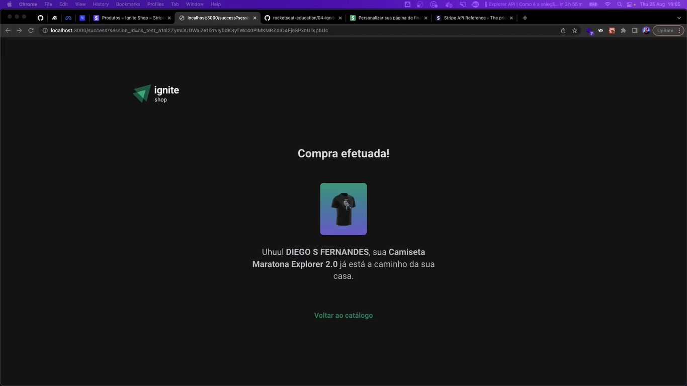
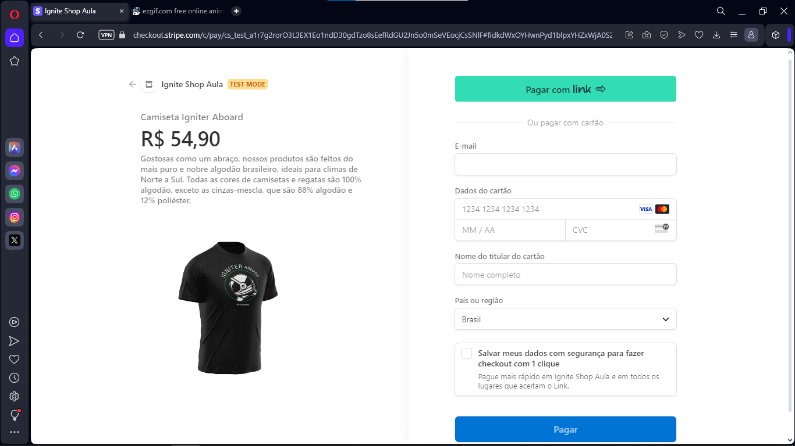

# Ignite Shop

<h1 align="center">
    
</h1>

<br>

### 💻 Ignite Shop
Sale of ignite shop t-shirts using Stripe's API to store/consume information, as well as redirection to make payment for items.
The objective was to create an e-commerce, which is integrated with Stripe. It was very important to consolidate knowledge in Server-Side Rendering (SSR) and Static Site Generation (SSG). 
The project was entirely developed by me, only the design was provided by Rocktseat through figma. Developed with both React/NextJS documentation, which gave me a lot of knowledge, beyond what was necessary to solve the challenge.

Watch it in action Deploy: [Click Here](https://ignite-shop-challenge-six.vercel.app/)

What was developed:

- Deploy Front with Vercel;
- Developed with NEXT JS (SSR | SSG)
- Styling with stitches.
- Radix Ui for highly accessible components
- Carousel with embla-carousel-react
- Stripe payments
- HTTP requests with axios
- Add product to cart
- Complete purchase via cart
- Perform checkout via stripe
- Product listing
- View total purchase amount
- Advancing in WEB Programming with ReactJS and Javascript/Typescript;
- States, state immutability and properties;
- Routes and React Router DOM;
- Components and Hooks; 
- Manipulating the DOM, Objects, Arrays and Events;
- Functions Callback;
- Working with colors and fonts;
- Applying spacing, aligning and positioning text and elements;
- File system structure of the project separated by folder;  
<br />

## 🧪 Tools

Application developed using the following tools:

- NextJs
- Typescript
- ESlint
- Embla-carousel-react
- Axios
- Phosphor-react
- Radix-ui
- Stitches
  
  <br />
  
- [Design Figma - Ignite Shop](https://www.figma.com/file/FxlDRKOmznBbTH8DsTgnZU/Ignite-Shop-2.0/duplicate)

## Ignite Shop screens:
 

## Ignite Shop Stripe:
 
 
 <br />

### Programs needed to Getting started

- [NodeJS](https://nodejs.org/en/)
- [Visual Studio Code - Vscode](https://code.visualstudio.com/)
- [Git](https://git-scm.com/)

Clone the project and access the folder

```bash
  # Clone this repository
  $ git clone https://github.com/felipe-gomes-vicente/ignite-shop-challenge.git

  # Access the project folder in your terminal
  $ cd ignite-shop-challenge

  # Install the dependencies
  $ npm install

  # Run the application in development mode
  $ npm run dev

  # The application will open on the port: 3000 - go to http://localhost:3000/ or http://127.0.0.1:3000/ 
```

### To carry out payment tests, use the Stripe test card!

```bash
4242 4242 4242 4242
# You can use any valid date as the card expiration date
# You can use any CVC
```


## 📝 License

This project is under the MIT license. See the file [LICENSE](LICENSE) for more details.

---

&nbsp;

<p align="center">Done with 💜 by Felipe Vicente👋</p>

- ## My LinkedIn - [](https://www.linkedin.com/in/felipe-gomes-vicente/)